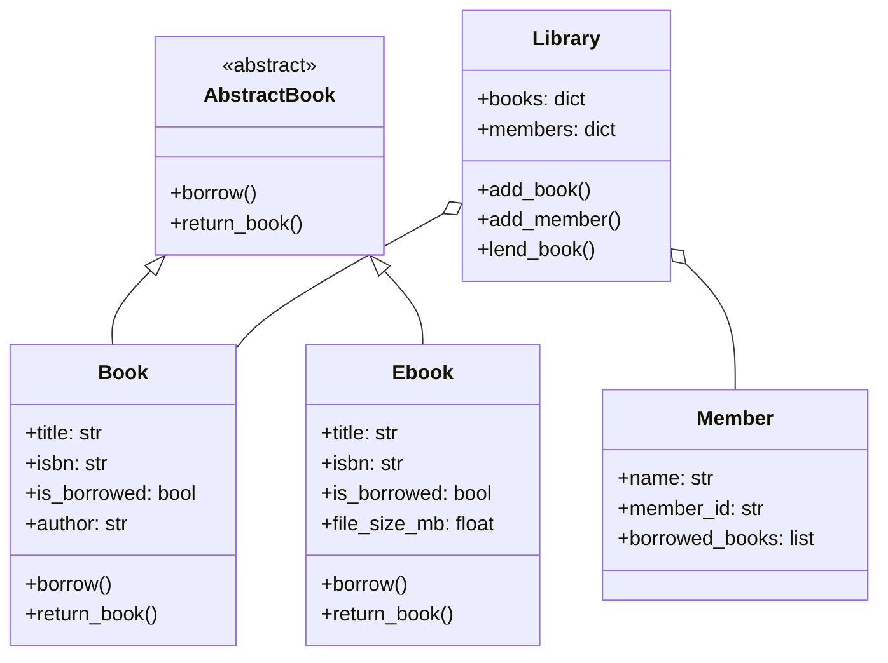

# Library System

A backend-driven library management application for managing
books, members, and borrowing transactions.

## Problem Statement

Small libraries may manage books, members, and borrowing records manually. As the number of books and members grows, keeping track of which books are available, which are currently borrowed, and who has borrowed them can become difficult to manage accurately.
This project addresses that problem by providing a centralized system for managing books, members, and borrowing transactions.

## Solution
A web-based library management application that centralizes book, member, and borrowing management. The system provides authenticated access to library operations, persists data through a relational database, and exposes the core functionality through a FastAPI backend and web interface.

## Key features
* **Member Management** - Register and manage library members.
* **Book Management** - Add and manage books in the library.
* **Book Lending** - Lend books to registered members while tracking their lending status.
* **Librarian Authentication** - Authenticate librarians to control access to the library management system.


## Architecture
## System Architecture

The application follows a layered architecture that separates the user interface, API layer, application logic, data access, and persistence.

```text
                    ┌──────────────────────┐
                    │      Frontend        │
                    │   HTML/CSS/JavaScript│
                    └──────────┬───────────┘
                               │ HTTP
                               ▼
                    ┌──────────────────────┐
                    │       FastAPI        │
                    │      REST API        │
                    └──────────┬───────────┘
                               │
                 ┌─────────────┴─────────────┐
                 │                           │
                 ▼                           ▼
        ┌─────────────────┐        ┌─────────────────┐
        │ Application     │        │ Authentication  │
        │ Logic / Domain  │        │ JWT + pwdlib    │
        └────────┬────────┘        └─────────────────┘
                 │
                 ▼
        ┌─────────────────┐
        │   Repository    │
        │     Layer       │
        └────────┬────────┘
                 │ SQLAlchemy
                 ▼
        ┌─────────────────┐
        │     SQLite      │
        │    Database     │
        └─────────────────┘
```

The frontend communicates with the FastAPI backend through HTTP requests. The backend handles API requests and application logic, while the repository layer manages database operations through SQLAlchemy. JWT-based authentication and password hashing are used to protect authenticated operations.

## Why this project exists

This was built as a deliberate practice project to internalize OOP
fundamentals and professional project structure before building larger,
database-backed backend systems. See [docs/design.md](docs/design.md)
for the full design reasoning (CRC cards, responsibility decisions).

## Features

- Book and Ebook classes sharing a common AbstractBook contract
- Library coordinates lending, tracking availability across books and members
- Encapsulated state (e.g. a book can't be double-borrowed, or have its
  title corrupted by invalid input)
- 17 passing tests covering both success and failure paths


## Data Model

The system uses three primary database models:

* **Book** - Stores book information including title, author, ISBN, and borrowing status.
* **Member** - Stores registered library members and their unique member IDs.
* **User** - Stores librarian credentials used for authentication.

### Relationships

A member can borrow multiple books, while a book can be borrowed by at most one member at a time. The relationship is represented through the `member_id` foreign key on the `books` table.

```text
┌──────────────────┐
│      users       │
├──────────────────┤
│ id               │
│ user_name        │
│ hashed_password  │
└──────────────────┘
        │
        │ authenticates
        ▼
   ┌──────────┐
   │Librarian │
   └──────────┘


┌──────────────────┐          ┌──────────────────┐
│     members      │          │      books       │
├──────────────────┤          ├──────────────────┤
│ id               │◄─────────│ member_id (FK)   │
│ name             │   1   N  │ id               │
│ member_id        │          │ title            │
└──────────────────┘          │ author           │
                              │ isbn             │
                              │ is_borrowed      │
                              └──────────────────┘
```

The database layer is implemented using SQLAlchemy ORM with SQLite as the persistence layer.


## API Overview

The application exposes a REST API for managing books, lending operations, and librarian authentication.

| Method | Endpoint        | Description                                            | Authentication |
| ------ | --------------- | ------------------------------------------------------ | -------------- |
| `GET`  | `/books`        | Retrieve all books                                     | No             |
| `POST` | `/books`        | Add a new book                                         | No             |
| `GET`  | `/books/{isbn}` | Retrieve a book by ISBN                                | No             |
| `POST` | `/lend`         | Lend a book to a member                                | JWT required   |
| `POST` | `/register`     | Register a librarian account                           | No             |
| `POST` | `/token`        | Authenticate a librarian and obtain a JWT access token | No             |

### Example Workflow

```text
Register librarian
       │
       ▼
  POST /register
       │
       ▼
  POST /token
       │
       ▼
   JWT token
       │
       ▼
   POST /lend
       │
       ▼
  Book borrowed
```

Interactive API documentation is available through FastAPI's generated documentation.


## Class Diagram



## Running Locally

```bash
git clone https://github.com/marcndo/library-system.git
cd library-system
pip install -r requirements.txt
python3 -m pytest    # run the test suite
```

## Design Documentation

Full CRC cards and design reasoning: [docs/design.md](docs/design.md)


