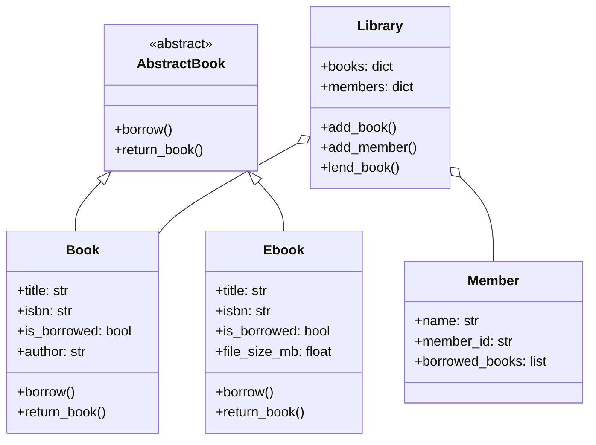

# Library System

A small library management system built to demonstrate core object-oriented
design - composition, encapsulation, abstraction, and polymorphism - backed
by a full pytest test suite and documented design decisions (CRC cards + UML).

## Why this project exists

This was built as a deliberate practice project to internalize OOP
fundamentals and professional project structure before building larger,
database-backed backend systems. See [docs/design.md](docs/design.md)
for the full design reasoning (CRC cards, responsibility decisions).

## Features

- Book and Ebook classes sharing a common AbstractBook contract
- Library coordinates lending, tracking availability across books and members
- Encapsulated state (e.g. a book can't be double-borrowed, or have its
  title corrupted by invalid input)
- 17 passing tests covering both success and failure paths

## Class Diagram



## Running Locally

```bash
git clone https://github.com/marcndo/library-system.git
cd library-system
pip install -r requirements.txt
python3 -m pytest    # run the test suite
```

## Design Documentation

Full CRC cards and design reasoning: [docs/design.md](docs/design.md)