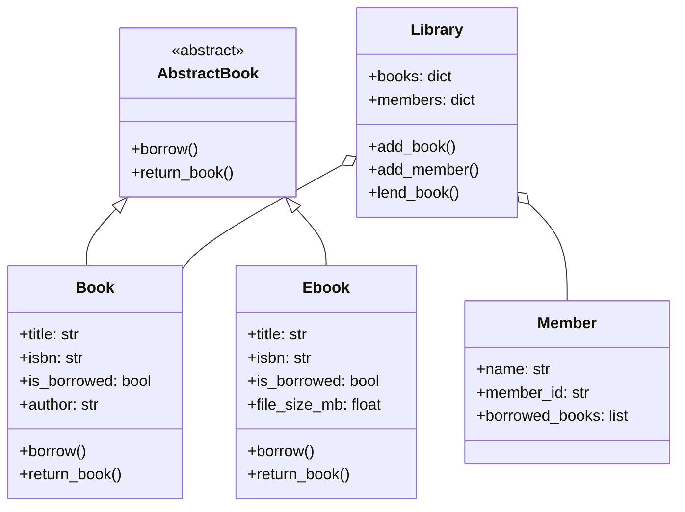

## Class Diagram

```mermaid
classDiagram
    class AbstractBook {
        <<abstract>>
        +borrow()
        +return_book()
    }
    class Book {
        +title: str
        +isbn: str
        +is_borrowed: bool
        +author: str
        +borrow()
        +return_book()
    }
    class Ebook {
        +title: str
        +isbn: str
        +is_borrowed: bool
        +file_size_mb: float
        +borrow()
        +return_book()
    }
    class Member {
        +name: str
        +member_id: str
        +borrowed_books: list
    }
    class Library {
        +books: dict
        +members: dict
        +add_book()
        +add_member()
        +lend_book()
    }
    AbstractBook <|-- Book
    AbstractBook <|-- Ebook
    Library o-- Book
    Library o-- Member
```
<|-- = inheritance arrow.
o-- = aggregation.